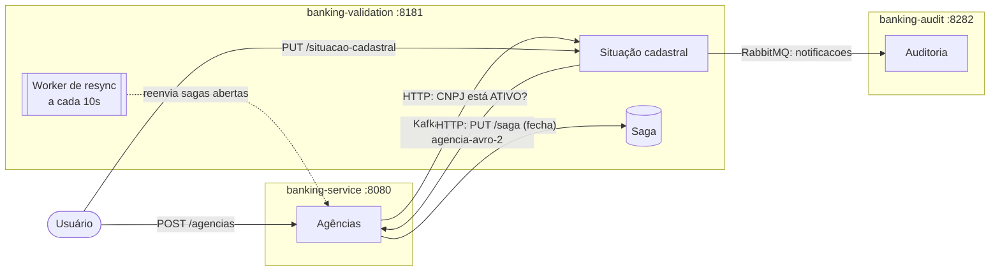

# Sistema Bancário: Mensageria com Kafka e RabbitMQ

Projeto de estudo (curso Alura) que simula o cadastro de **agências bancárias** usando microsserviços em **Quarkus reativo**, comunicação **HTTP**, **RabbitMQ**, **Kafka + Avro (Schema Registry)** e o padrão **Saga**.

## Visão geral

São 3 serviços, cada um com seu próprio banco PostgreSQL:

| Serviço | Porta | Papel | Banco |
|---|---|---|---|
| **banking-validation** | `8181` | "Receita Federal": guarda a situação cadastral (ATIVO/INATIVO) de cada CNPJ | `localhost:5432/agencia` |
| **banking-service** | `8080` | Cadastro de agências do banco | `localhost:5433/agencia` |
| **banking-audit** | `8282` | Registra o histórico de mudanças de situação cadastral | `localhost:5434/audit` |



## Como os fluxos funcionam

### 1. Cadastrar uma agência
1. Você faz `POST /agencias` no **banking-service**.
2. Ele pergunta via HTTP ao **banking-validation** se o CNPJ está `ATIVO`.
3. Se estiver ativo, a agência é salva. Senão, retorna erro.

### 2. Alterar a situação cadastral (auditoria)
1. Você faz `PUT /situacao-cadastral` no **banking-validation**.
2. A situação é atualizada e uma mensagem é enviada para o **RabbitMQ** (exchange `notificacoes`).
3. O **banking-audit** consome e grava o histórico. Mensagens com erro vão para uma **DLQ**.

### 3. Inativar uma agência (Saga)
Quando a situação muda para `INATIVO`, a agência precisa ser removida do **banking-service**. Como isso acontece em outro serviço, usamos uma **Saga** para garantir que a remoção aconteça:

1. O **banking-validation** abre uma saga com status `OPEN` (tabela `saga`).
2. Envia a agência para o **Kafka** (tópico `remover-agencia-avro-2`, serializada em **Avro**).
3. O **banking-service** consome, remove a agência e chama `PUT /saga` para marcar a saga como `COMPLETED`.
4. Se algo falhar no caminho, um **worker** roda a cada 10s e reenvia as sagas que estão `OPEN` há mais de 2 minutos.

## Tecnologias

- Java 21 + Quarkus 3 (Hibernate Reactive Panache, Mutiny)
- PostgreSQL 14
- RabbitMQ 3.10 (com painel de administração)
- Apache Kafka + Confluent Schema Registry (Avro)
- Docker / Docker Compose

## Como rodar

### Pré-requisitos
- Java 21
- Docker e Docker Compose

### 1. Subir a infraestrutura

```bash
# Postgres (validation), RabbitMQ, Zookeeper, Kafka e Schema Registry
cd banking-validation && docker compose up -d && cd ..

# Postgres do banking-service
cd banking-service && docker compose up -d && cd ..

# Postgres do banking-audit
cd banking-audit && docker compose up -d && cd ..
```

> Os scripts `init.sql` só rodam na **primeira** criação do container. Se mudou o `init.sql`, recrie com `docker compose down && docker compose up -d`.

### 2. Subir os serviços (um terminal para cada)

```bash
cd banking-validation && ./mvnw quarkus:dev
cd banking-service    && ./mvnw quarkus:dev
cd banking-audit      && ./mvnw quarkus:dev
```

### 3. Painéis úteis
- RabbitMQ: http://localhost:15672 (usuário/senha padrão `guest`/`guest`)
- Schema Registry: http://localhost:8081/subjects
- Métricas do banking-service: http://localhost:8080/metrics

## Testando na prática

**Consultar a situação cadastral** (o `init.sql` já cria um CNPJ ativo):
```bash
curl http://localhost:8181/situacao-cadastral/15130254000100
```

**Cadastrar uma agência:**
```bash
curl -i -X POST http://localhost:8080/agencias \
  -H "Content-Type: application/json" \
  -d '{
    "nome": "Agencia BSB",
    "razaoSocial": "Asa Norte AGENCIA BSB",
    "cnpj": "15130254000100",
    "endereco": { "rua": "Rua 1", "logradouro": "Asa Norte", "complemento": "Loja 2", "numero": 10 }
  }'
```

**Inativar o CNPJ** (dispara auditoria + saga de remoção):
```bash
curl -i -X PUT http://localhost:8181/situacao-cadastral \
  -H "Content-Type: application/json" \
  -d '{
    "nome": "Agencia BSB",
    "razaoSocial": "Asa Norte AGENCIA BSB",
    "cnpj": "15130254000100",
    "situacaoCadastral": "INATIVO"
  }'
```

Depois disso, confira:
- a agência sumiu do banco do **banking-service**;
- a saga ficou `COMPLETED` na tabela `saga` do **banking-validation**;
- um registro novo apareceu na tabela `audit` do **banking-audit**.

## Endpoints

**banking-validation (`:8181`)**

| Método | Rota | Descrição |
|---|---|---|
| `GET` | `/situacao-cadastral` | Lista todas as situações |
| `GET` | `/situacao-cadastral/{cnpj}` | Busca por CNPJ (`204` se não existir) |
| `POST` | `/situacao-cadastral` | Cadastra um CNPJ |
| `PUT` | `/situacao-cadastral` | Altera a situação (dispara RabbitMQ e, se `INATIVO`, a saga) |
| `PUT` | `/saga` | Fecha a saga (corpo: CNPJ), usado pelo banking-service |

**banking-service (`:8080`)**

| Método | Rota | Descrição |
|---|---|---|
| `POST` | `/agencias` | Cadastra agência (só se o CNPJ estiver ATIVO) |
| `GET` | `/agencias/{id}` | Busca por id |
| `PUT` | `/agencias` | Altera nome, razão social e CNPJ |
| `DELETE` | `/agencias/{id}` | Remove agência |

**banking-audit (`:8282`)** não tem endpoints, só consome a fila `notificacoes.agencia.change_status`.

## Estrutura

```
sistema-bancario/
├── banking-validation/   # situação cadastral, saga e worker de resync
│   ├── docker-compose.yml   # Postgres, RabbitMQ, Kafka, Zookeeper, Schema Registry
│   ├── init.sql             # tabelas agencia e saga
│   └── src/main/avro/       # schema Avro da Agencia
├── banking-service/      # cadastro de agências e consumer Kafka
│   └── src/main/avro/       # mesmo schema Avro (lado consumidor)
└── banking-audit/        # consumer RabbitMQ que grava a auditoria
    └── init.sql             # tabela audit
```
